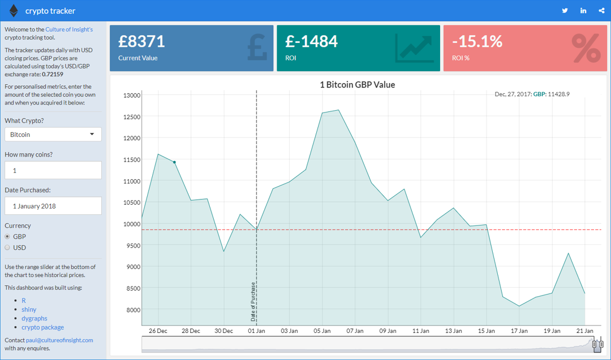

# crypto tracker

shiny app to get personalised metrics on cryptocurrency investments

### Features

- Fetches real-time coin prices from the coinmarketcap API via the [RCrypto pacage](https://cran.r-project.org/web/packages/RCrypto/index.html)
- Uses googlesheets for persistent data storage
- Dygraph for interactive time-series charting

[cultureofinsight.shinyapps.io/crypto_tracker/](https://cultureofinsight.shinyapps.io/crypto_tracker/)

